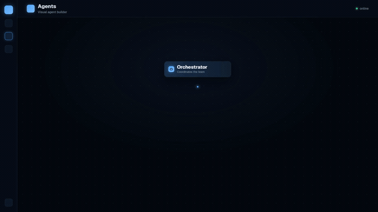

<div align="center">


# Nexora

**Multi-tenant AI-agent orchestration platform.**
Define agents with personas, skills, and tools. Let them chat in real time, execute tools,
decompose work, delegate to sub-agents, and stream results — all self-hosted, on your own infra.


<a href="https://nexora.parendum.com">
  
</a>

**[🌐 Website](https://nexora.parendum.com) · [📖 Docs](https://docs.nexora.parendum.com) · [🧩 Marketplace](https://marketplace.nexora.parendum.com)**

</div>

---

## What is Nexora?

Nexora is the **free, MIT-licensed OSS core** of an AI-agent orchestration platform. Users
build agents (personas + skills + tools), and those agents collaborate in real time:
they run tools, break work into tasks, spawn bounded sub-agents, and stream their output
over WebSocket or SSE.

This repository is **pure platform** — zero billing, licensing, or paywall logic. The paid
self-hosted product (NexoraCloud) consumes this repo and layers commercial features on top.

### Why Nexora?

- **🔒 Self-hosted, your data stays yours.** Runs entirely on your own infra — no agent traffic leaves your network.
- **🔌 No vendor lock-in.** ~46 LLM providers behind one interface; swap Claude ↔ GPT ↔ Gemini ↔ local Ollama without touching your agents.
- **🤝 Real multi-agent orchestration.** Agents delegate to sub-agents, run tools, and stream results in parallel — not just a single chat loop.
- **🧩 Extensible by design.** Knowledge bases (RAG), semantic memory, ~90 built-in tools, and a package marketplace.
- **🆓 MIT-licensed core.** Use it, fork it, ship it. Commercial features are opt-in via NexoraCloud.

### Use cases

- Internal **AI ops** assistants that touch Slack, Jira, Kubernetes, and your own APIs.
- **Research / RAG** agents grounded in your private knowledge bases.
- **Automation crews** that decompose a goal into tasks and execute them across sub-agents.
- A **self-hosted alternative** to closed agent platforms, with full control over models and data.

### Highlights

- **Agent builder** — visual React-Flow graph: personas, skills, tools, sub-agents, bounded delegation.
- **~46 LLM providers** (+3 OAuth) — Claude, Gemini, OpenAI, Ollama, Vertex, Bedrock, Azure,
  Cohere, DeepSeek, Groq, Mistral, xAI, Perplexity, Together, Fireworks, OpenRouter, and more.
- **~90 built-in tools / ~15 skills** — Slack, Discord, Jira, Linear, Notion, PagerDuty, Google
  Drive, S3, Kubernetes, Playwright, hardened `http_request` (SSRF allowlist), agent-to-agent messaging.
- **Knowledge base / RAG** (pgvector) + **semantic memory** search + **multimodal image input**.
- **Real-time streaming** over WebSocket, with an SSE alternative.
- **Multi-tenant auth** — email/password (Argon2), JWT, API keys, invite-only mode, TOTP 2FA.
- **Marketplace client** — install community skills/tools/personas/agents with dependency auto-install.
- **Recovery engine** — retries, circuit breaker, stale-heartbeat watchdog.
- **Full-platform backup / restore** — export a whole instance (or one org) to a portable ZIP.
- **Clients** — web UI, [terminal client (NexoraCLI)](https://github.com/ParendumOU/Nexora-CLI),
  and a [mobile app (NexoraMobile)](https://github.com/ParendumOU/Nexora-Mobile).

---

## Screenshots

| Chat | Orchestration (sub-agents + task tree) |
|------|----------------------------------------|
|  |  |

More in the [documentation](https://docs.nexora.parendum.com).

---

## Tech stack

| Layer | Tech |
|-------|------|
| Backend | Python 3.12, FastAPI, SQLAlchemy 2 (async), Alembic |
| Frontend | Next.js 15 (App Router), TypeScript, Tailwind, Zustand, React Flow |
| Data | PostgreSQL 16 + pgvector, Redis 7 |
| Proxy | nginx 1.27 |
| Runtime | Docker Compose |

---

## Quick start

```bash
git clone https://github.com/ParendumOU/Nexora.git
cd Nexora

cp .env.example .env          # then set SECRET_KEY + ENCRYPTION_KEY (see SETUP.md)

make dev                      # dev stack: backend :8000, frontend :3000, nginx :8080
# or
make up                       # production stack (nginx on HTTP_PORT, default 80)

docker compose exec backend alembic upgrade head   # run migrations on first boot
```

First visit with no users → `/setup` to create the admin account.
Full instructions in [`SETUP.md`](SETUP.md).

### Common commands

```bash
make dev      # dev (hot reload)
make up       # production
make down     # stop
make logs     # tail logs
make clean    # stop + wipe volumes (DESTRUCTIVE)
```

---

## Project layout

```
backend/        FastAPI app (agents, orchestration, providers, tools, RAG, auth)
frontend/       Next.js 15 web UI
nginx/          reverse proxy config
docker-compose*.yml   prod / dev / data-only stacks
SETUP.md        standalone setup guide
```

---

## Clients

| Client | Repo |
|--------|------|
| Terminal (Go TUI) | [ParendumOU/Nexora-CLI](https://github.com/ParendumOU/Nexora-CLI) |
| iOS / Android | [ParendumOU/Nexora-Mobile](https://github.com/ParendumOU/Nexora-Mobile) |

---

## Contributing

Issues and PRs welcome. See [`CONTRIBUTING.md`](CONTRIBUTING.md) and our
[`CODE_OF_CONDUCT.md`](CODE_OF_CONDUCT.md). For security reports, see [`SECURITY.md`](SECURITY.md).

---

## License

[MIT](LICENSE) © Parendum OÜ

---

## ⭐ Like what you see?

If Nexora saves you from wiring agents together by hand, **drop a star** — it helps others
discover the project and directly shapes the roadmap. Got a question or want to show what you
built? Open an issue or join us at **[nexora.parendum.com](https://nexora.parendum.com)**.

---

## Star history

<a href="https://www.star-history.com/?repos=ParendumOU%2FNexora&type=date&legend=top-left">
  <picture>
    <source media="(prefers-color-scheme: dark)" srcset="https://api.star-history.com/chart?repos=ParendumOU/Nexora&type=date&theme=dark&legend=top-left" />
    <source media="(prefers-color-scheme: light)" srcset="https://api.star-history.com/chart?repos=ParendumOU/Nexora&type=date&legend=top-left" />
    
  </picture>
</a>
